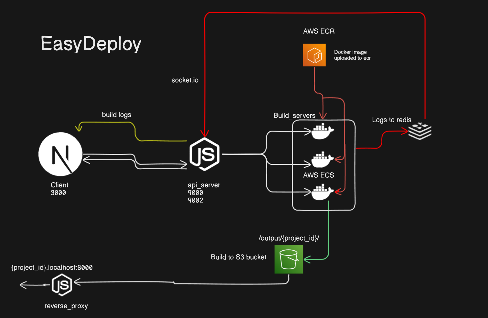

# EasyDeploy | Git repo to deployed site | AWS

EasyDeploy is a deployment service that streamlines the deployment process for React applications on AWS ECS Docker containers with logs streaming. It automates the setup, build, and deployment of applications, making it easy to deploy and serve React apps at scale using proper system design principles.

## Project Demo

[](https://youtu.be/-gj5By1Q3CU)

For obvious reasons <i>(pricing issues) </i>, this project is not live deployed but setup instructions are given below. Please refer to the [Setup](#setup) section for detailed instructions.

## Features

- Automatically deploys React applications to AWS ECS Docker containers
- Clones GitHub repositories, installs dependencies, and sets up environment variables
- Builds the application and uploads it to an S3 bucket
- Serves the website from S3 to a local host URL using proper DNS and reverse proxy.

## Components

1. Build Server (DockerFile for ECS container)
2. API Server (Intializes the ECS container and streams logs using Socket connection and Redis)
3. Proxy Service (Serves webpages from )
4. Client Website (Frontend for project)

## Architecture



## Technologies used

| Service        | Technologies used                         |
| -------------- | ----------------------------------------- |
| Client Website | Next.js, Shadcn.ui, Socket.io             |
| Build Server   | Docker, AWS-ECS,ECR,S3, Redis.io, Fargate |
| API Server     | Node.js, Socket.io, IoRedis               |
| Reverse Proxy  | Node.js, http-proxy, AWS-S3               |

## Setup

1. Clone the repository:

```bash
git clone https://github.com/username/easydeploy.git
cd easydeploy
```

2. Go to individual services and install the dependencies

```bash
# API Server
cd ../api_server
npm install

# Proxy Service
cd ../proxy_service
npm install

# Client Website
cd ../client
npm install
```

3. For build server set up the env variables. Build the docker image, and upload it to ECR.
   For docker build in build_server use command.

`docker buildx build --platform linux/arm64 -t {your_image_name} .`

4. Make cluster group and task definations and add the necessory keys to the respective env files of api_server and proxy service

5. Run the services.

- Run client website :
  ` cd client && npm run dev`

- Run api_server :
  ` cd api_server && node index.js`

- Run client website :
  ` cd proxy_service && node index.js`

6. Go to `localhost:3000` and add a git repo url.

7. Wait for the project to be built and then click the generated url

## Support

If you have any questions or need assistance, please contact me at any of the socials in my website https://ishanaudichya.netlify.app

Thanks ♥
