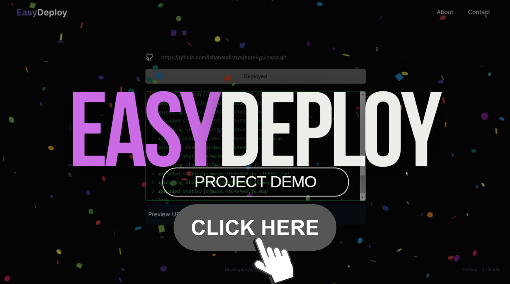

# netlify

For docker build in build_server are.

`docker buildx build --platform linux/arm64 -t netlify-builder-image .`

Todos

- Make proxy service set up basepath from env
- Use @aws-sdk/client-ecs to run ecs task in api server
- Use random-word-slugs to name project id https://www.npmjs.com/package/random-word-slugs
- Port 9000 to run api server
